# Quiet Moments

***Quiet Moments*** is a solo tabletop RPG adventure set in the gentle rhythms of everyday life, where small victories matter and ordinary moments hold extraordinary meaning.

This minimalist Solo Role Playing Game is designed to explore the beauty of daily existence, personal growth, and the connections that make life meaningful through intimate storytelling and reflective gameplay.

## Introduction

*Quiet Moments* follows the following design principles:

1. **Portable**: to play you will need a few common (six-sided) dice and writing materials. Anything else is optional and not essential.
2. **Rules-Light**: the game relies on a few rules and only one solving mechanic, easy to learn and eventually to memorize.
3. **Tag-based**: characters and situations are defined only by qualitative descriptors and no quantitative characteristics.

With a focus on quiet resolutions, **Quiet Moments** draws you into the heart of ordinary life. Your character will be defined by thematic tags, like *Caring*, *Anxious*, *Creative*, or *Nostalgic*.

### What is a Role Playing Game (RPG)?

A role-playing game (RPG) is a way to explore a story by stepping into the role of a character and making choices as if you were them. The world responds to those choices, and together player and game create events that didn’t exist before.

Many RPGs focus on adventure and danger. *Quiet Moments* is different — here, the story can grow from small, everyday details: conversations over coffee, a walk in the rain, a change in routine.

If you’ve ever kept a journal, improvised a scene in a writing group, or become absorbed in a life-simulation game, you already know the feeling. You’re shaping a narrative one choice at a time, without knowing exactly where it will lead.

### What is a Solo RPG?

A solo RPG is a role-playing game you play alone, taking on one or more characters while also shaping the world around them. Instead of another player acting as referee, you use tools — such as an oracle, random tables, and prompts — to decide how the world reacts.

Unlike a gamebook, where every possible outcome is written in advance, a solo RPG is open-ended. Each choice, roll, and inspiration builds an **emergent narrative**, whether that’s a quiet afternoon of reflection, a slow-growing friendship, or the gentle shift of a life over time.

### Safety Tools

Even when playing alone, your comfort matters. Choose a space where you can relax, with as few distractions as possible. You’re free to pause at any time if something feels uncomfortable — physically, mentally, or emotionally.

It’s fine to explore new or challenging themes, but do so at your own pace and with a clear sense of your boundaries. This is your story, and you decide what belongs in it.

### Game Materials

To play *Quiet Moments* you will need:
- **4 six sided dice** (also known as d6s): two pairs of different colors
- **Paper and writing tools**: at least a sheet of scrap paper and and pencil, but index cards or sticky notes are a fine addition
- **Character sheet**: you may use the provided sheet at the back or a simple index card.
- **Notebook**: *Quiet Moments* is not a solo journaling game, you can easily play it in the "theater of mind". But you can keep track of you game if you feel the need!

## Context Introduction

*Quiet Moments* takes place in the contemporary world we know, but focuses on the intimate spaces where life unfolds:

- **Home & Family**: The comfort and complexity of domestic life, family dynamics, childhood memories, and the spaces that shape us
- **Work & Purpose**: Daily routines, career challenges, finding meaning in labor, workplace relationships, and professional growth
- **Community & Connection**: Neighborhoods, local gathering places, chance encounters, friendships forming and evolving
- **Personal Growth**: Learning new skills, confronting fears, developing hobbies, moments of self-discovery
- **Seasons & Time**: How weather, holidays, and the passage of time affect mood and perspective
- **Small Pleasures**: Morning coffee, favorite books, comfort foods, peaceful moments that sustain the spirit

### Playable Themes

- Coming of age and self-discovery
- Family relationships across generations
- Romantic relationships and their gentle complexities
- Friendship and community building
- Creative pursuits and artistic expression
- Career transitions and finding purpose
- Seasonal changes and their emotional impact
- Nostalgia and processing memories
- Daily rituals and their meaning
- Acts of kindness and their ripple effects
- Personal challenges overcome through patience
- The beauty found in routine and repetition

### Time Spans

*Quiet Moments* unfolds in real-time seasons and can span:
- **A Single Day**: Focus on morning routines, work interactions, evening reflections
- **A Week**: Explore how daily rhythms build into larger patterns
- **A Season**: Watch character growth unfold through months of gentle change
- **A Year**: Experience the full cycle of seasons, holidays, and personal milestones
- **A Lifetime**: Tell generational stories, showing how small moments accumulate into a life well-lived

## Characters

In the world of *Quiet Moments*, every person you encounter has their own inner life, dreams, and daily struggles that matter just as much as dramatic adventures.

### Everything is a Character!

In *Quiet Moments* Non-Playing Characters (NPCs), Family Members, Coworkers, Neighbors, Pets, and even meaningful places like favorite cafés or childhood homes are characters too!

Your Protagonist is described by some fixed traits:

- **Name**: The name should feel real and grounded, reflecting their background and the world they inhabit.
- **Concept**: A concise description of the character's role, personality, and current life phase. The best are adjective-noun pairings, like *"Thoughtful Teacher"* or *"Aspiring Baker"*.
- **Skills** (x2): Abilities that help navigate daily life and personal challenges. *"Good Listener"* and *"Green Thumb"* are more relevant than combat prowess.
- **Frailty**: Something that creates gentle obstacles or personal growth opportunities - social anxiety, perfectionism, or difficulty saying no.
- **Gear** (x2): Meaningful possessions that define character or enable their pursuits - grandmother's recipe box, worn leather journal, vintage camera.
- **Goal**: The long-term aspiration that gives life direction.
- **Motive**: What emotional need drives the pursuit of that goal.
- **Nemesis**: A person, habit, or situation that creates ongoing gentle conflict - not villains, but sources of stress, self-doubt, or complication.
- **Luck**: The measure of a character's ability to navigate social situations and daily challenges gracefully. It applies only in Conflicts and automatically recharges when they end. Luck starts and caps at 6.

These **traits** are described by **tags**, descriptive words or phrases that can identify anything in the game world. Even the **details** of environments like cozy kitchens or bustling farmer's markets and **conditions** like homesick or inspired are tags. 

**They are qualitative representations. They are not quantitative measures.**

### Character Traits

You can use these traits to create a character on the fly, mix them, or just use them as inspiration.

## Character Traits

#### Concepts

|     | 1             | 2               | 3              | 4               | 5               | 6              |
| --- | ------------- | --------------- | -------------- | --------------- | --------------- | -------------- |
| 1   | Caring Nurse  | Retired Teacher | Young Parent   | College Student | Small Shop Owner| Local Artist   |
| 2   | Office Worker | Community Volunteer| Home Baker  | Part-time Writer| Neighborhood Handyman| Library Assistant|
| 3   | High School Student| Single Parent | Cafe Regular   | Weekend Gardener| Amateur Musician| Bookstore Clerk|
| 4   | Freelance Designer| Dog Walker    | Night Shift Worker| Cooking Enthusiast| Photography Hobbyist| Community Organizer|
| 5   | Recent Graduate| Empty Nester   | Local Historian| Craft Store Owner| Yoga Instructor | Farmer's Market Vendor|
| 6   | Substitute Teacher| Apartment Manager| Coffee Roaster| Vintage Collector| Children's Tutor| Community Garden Caretaker|

#### Skills

|     | 1              | 2               | 3              | 4               | 5               | 6              |
| --- | -------------- | --------------- | -------------- | --------------- | --------------- | -------------- |
| 1   | Good Listener  | Excellent Cook  | Green Thumb    | Natural Teacher | Skilled Mediator| Memory Keeper  |
| 2   | Detail Oriented| Empathetic     | Creative Problem Solver| Patient Observer| Gentle Humor   | Reliable Friend|
| 3   | Skilled Baker  | Plant Whisperer| Story Teller   | Conflict Resolver| Natural Host   | Keen Eye for Beauty|
| 4   | Handy with Tools| Intuitive Counselor| Rhythm Keeper| Weather Reader  | Gift Giver     | Bridge Builder |
| 5   | Memory Jogger  | Comfort Provider| Hope Bringer   | Tradition Keeper| Change Navigator| Peace Maker    |
| 6   | Pattern Reader | Connection Maker| Gentle Leader  | Culture Keeper  | Joy Spreader   | Time Manager   |

#### Frailties

|     | 1                | 2               | 3              | 4               | 5               | 6              |
| --- | ---------------- | --------------- | -------------- | --------------- | --------------- | -------------- |
| 1   | Social Anxiety   | Perfectionist   | Chronic Worrier| Difficulty Saying No| Imposter Syndrome| Conflict Avoidant|
| 2   | Overwhelmed Easily| Overly Critical | Procrastinator | Too Trusting    | Financially Anxious| Comparison Trap |
| 3   | Homesick         | Change Resistant| Oversharer     | Boundary Issues | Self-Doubting   | Nostalgic      |
| 4   | Time Management  | Fear of Failure | Emotionally Sensitive| Health Anxious| Workaholic     | Isolation Tendency|
| 5   | Difficulty Asking Help| Pessimistic | Overly Responsible| Decision Paralysis| Communication Shy| Past-Focused   |
| 6   | Energy Depletion | Trust Issues    | Approval Seeking| Technology Challenged| Routine Dependent| Change Fearful |

#### Gear

|     | 1                 | 2               | 3              | 4               | 5               | 6              |
| --- | ----------------- | --------------- | -------------- | --------------- | --------------- | -------------- |
| 1   | Family Recipe Box | Worn Journal    | Vintage Camera | Grandmother's Ring| Well-Read Books| Lucky Coffee Mug|
| 2   | Garden Tools      | Art Supplies    | Musical Instrument| Comfort Blanket| Photo Albums   | Hand-knit Scarf|
| 3   | Kitchen Timer     | Address Book    | Bike with Basket| Favorite Teapot| Memory Box     | Handwritten Letters|
| 4   | Walking Shoes     | Craft Supplies  | Thermos        | Reading Glasses | Pocket Notebook| House Plants   |
| 5   | Baking Pans       | Sewing Kit      | Radio          | Bird Watching Guide| Yoga Mat     | Cooking Spices |
| 6   | Toolbox           | Board Games     | Puzzle Collection| Seed Packets   | Wind Chimes    | Recipe Clippings|

### Names

#### Female Names

|     | 1       | 2        | 3       | 4        | 5        | 6       |
| --- | ------- | -------- | ------- | -------- | -------- | ------- |
| 1   | Sarah   | Emma     | Claire  | Maya     | Sophie   | Grace   |
| 2   | Anna    | Lily     | Rose    | Elena    | Iris     | Beth    |
| 3   | Marie   | Lucy     | Kate    | Nina     | Amy      | Joy     |
| 4   | Olive   | Ruby     | Stella  | Luna     | Eve      | Hope    |
| 5   | Hazel   | Ivy      | Pearl   | Dawn     | Faye     | Sage    |
| 6   | Vera    | June     | Nora    | Wren     | Belle    | Mae     |

#### Male Names

|     | 1       | 2        | 3       | 4        | 5        | 6       |
| --- | ------- | -------- | ------- | -------- | -------- | ------- |
| 1   | David   | Michael  | James   | Daniel   | Matthew  | John    |
| 2   | Thomas  | William  | Robert  | Andrew   | Samuel   | Paul    |
| 3   | Peter   | Mark     | Luke    | Simon    | Nathan   | Adam    |
| 4   | Oliver  | Henry    | Leo     | Felix    | Oscar    | Max     |
| 5   | Ethan   | Noah     | Eli     | Owen     | Miles    | Cole    |
| 6   | Finn    | Jack     | Ryan    | Ben      | Luke     | Sage    |

#### Surnames

|     | 1        | 2        | 3        | 4        | 5        | 6        |
| --- | -------- | -------- | -------- | -------- | -------- | -------- |
| 1   | Johnson  | Williams | Brown    | Jones    | Garcia   | Miller   |
| 2   | Davis    | Rodriguez| Wilson   | Martinez | Anderson | Taylor   |
| 3   | Thomas   | Hernandez| Moore    | Martin   | Jackson  | Thompson |
| 4   | White    | Lopez    | Lee      | Gonzalez | Harris   | Clark    |
| 5   | Lewis    | Robinson | Walker   | Perez    | Hall     | Young    |
| 6   | Allen    | Sanchez  | Wright   | King     | Scott    | Green    |

#### Nicknames

|     | 1       | 2       | 3       | 4       | 5       | 6       |
| --- | ------- | ------- | ------- | ------- | ------- | ------- |
| 1   | Sunny   | Bear    | Pip     | Mouse   | Ace     | Blue    |
| 2   | Doc     | Chef    | Coach   | Teach   | Fix     | Smile   |
| 3   | Lucky   | Spark   | River   | Sky     | Dawn    | Moon    |
| 4   | Patch   | Button  | Cricket | Pebble  | Sage    | Honey   |
| 5   | Flash   | Gentle  | Steady  | Bright  | Calm    | Swift   |
| 6   | Whisper | Thunder | Breeze  | Stone   | Flame   | Wave    |

## Rules

*Quiet Moments* is a minimalist Solo Role Playing Game designed to be played with only one character (the Protagonist). You'll guide them through the story that will unravel during the game, asking closed questions to an Oracle which will help you overturn your expectations.

Every now and then you will be surprised with an unexpected twist!

### Keep The Action In Motion

A game in *Quiet Moments* is a succession of scenes. 
A scene is a unit of time in which a certain action takes place in pursuit of a certain short-term goal. 

In *Quiet Moments* at each scene:
1. **Identify what you expect from the scene**. Compared to traits, goal, and motivation determine the Protagonist's action. What might be the reaction of the game world?
2. **Test your expectations**. When you are uncertain (or overconfident) about the reaction to your actions, [ask the Oracle](#consulting-the-oracle) a closed question (answer is Yes or No), considering the tags involved to determine if there is an [Advantage or Disadvantage](#advantage-and-disadvantage).
3. **Interpret the result**. Is the Oracle's answer in line with your expectations? If not, in the context in which the scene takes place, how should an answer that subverts them be considered?

This sequence will come to you naturally after some practice. Use it as a guideline the first few times.

### Consulting the Oracle

When you need to test your expectations you'll ask the Oracle a closed question.

You'll need 2d6 in one color (**Chance Dice**), and 2d6 in another (**Risk Dice**).

To resolve a closed question, roll one **Chance Die** and one **Risk Die**:
- If the Chance Die is highest, the answer is **Yes**. 
- If the Risk Die is highest, the answer is **No**.
- If both are low (3 or less), add a **but...**. 
- If both are high (4 or more), add an **and...**.
- If both are equal, the answer is **Yes, but...**. Add a point to the **[Twist Counter](#twist-counter)**.

| Dice Value |    Chance Die > Risk Die   | Risk Die > Chance Die |
|:----------:|:--------------------------:|:---------------------:|
|  Both < 4  |         Yes, but...        |       No, but...      |
|  Both > 3  |         Yes, and...        |       No, and...      |
| Mismatched |             Yes            |           No          |
|            |                            |                       |
|    Equal   | Add 1 to the Twist Counter |                       |

### Advantage and Disadvantage

If circumstances or positive tags grant an advantage, add a **Chance Die** to the roll. Otherwise, when hindrances or negative tag cause a disadvantage, add a **Risk Die**. In both cases keep only the higher die of the added type when you check the roll.

Consider tags **intuitively and not quantitatively**, using the context of the situation at play. It is important to keep the flow of play fast and not accounting for advantages and disadvantages numerically!

### Twist Counter

The Twist Counter is a measure of the rising tension in the narrative. At the beginning is set to 0. Every time a double throw (dice are equal) happens, add 1 to the Counter. If the Counter is below three, consider the answer as "**Yes, but...**". Otherwise a **Twist** happens and resets the Counter.

Roll 2d6 and consult the following Twist Table to determine what kind of twist happens. 

| D6 |      Subject       |        Action       |
|:--:|:------------------:|:-------------------:|
|  1 |    A neighbor      |       Arrives       |
|  2 |      The protagonist |   Recalls something |
|  3 |    A phone call    |    Brings news      |
|  4 |  Weather changes   |   Shifts the mood   |
|  5 | An old memory      |   Surfaces suddenly |
|  6 |    A small object  |    Reveals meaning  |

Interpret the two-word sentence in the context of the current scene. Twists will keep the plot and events going in unexpected ways.

### Conflicts

A *Conflict* in *Quiet Moments* is any situation involving emotional stakes, social tension, or personal challenges.
This includes difficult conversations, family disagreements, workplace stress, creative blocks, social anxiety, or internal struggles with self-doubt.

Conflicts can be resolved in different ways depending on preferences and context:
1. Ask a single closed question. The Oracle's answer determines the outcome of the conflict.
2. Ask a series of closed questions to resolve current single actions.
3. Use the rules of Harm & Luck below.

Note that the Twist Counter **does not apply** to Harm & Luck. Instead, it is used regularly if the Conflict is handled with closed questions.

If the conflict is resolved by applying damage to the Luck trait, roll the dice to determine whether the protagonist navigates the situation gracefully or experiences emotional strain. The rolls are player facing only.

The damage reduces the Luck of the target, whether protagonist or NPC. When the Luck runs out, the character has reached their emotional limit for the scene.

The final outcome depends on the context. Do they need space to recover? Is a relationship strained? Growth often comes through working past these moments.

| Answer      | Do you get what you want?                               | Harm    |
| ----------- | ------------------------------------------------------- | ------- |
| Yes, and... | You get what you want, and something else.              | Cause 3 |
| Yes...      | You get what you want.                                  | Cause 2 |
| Yes, but... | You get what you want, but at a cost.                   | Cause 1 |
| No, but...  | You don't get what you want, but it's not a total loss. | Take 1  |
| No...       | You don't get what you were after.                      | Take 2  |
| No, and...  | You don't get what you want, and things get worse.      | Take 3  |

### Determine the mood of the next scene

At the end of the current scene sometimes you will be clear about the direction to take, other times you may need to determine the general mood of the next one. In this case roll 1d6 and consult the following table:

|  D6 |   Next Scene   |
|:---:|:--------------:|
| 1-3 | Contemplative scene |
| 4-5 |   Social Scene  |
|  6  |   Meanwhile…   |

- A **contemplative scene** allows for internal reflection, personal growth moments, or quiet activities that restore the spirit.
- During a **social scene** the focus shifts to relationships, community interactions, or shared activities with others.
- A **meanwhile scene** takes place elsewhere, focusing on other important people in the protagonist's life or community.

### Open-Ended Question or Get Inspired

To answer an Open-Ended question, roll 1d6 once on each of the Inspiration Tables (roll at least a verb and a noun, adjectives are optional).

### When the story ends

At the end of the adventure you may add another trait to the character. It is better that this is related to how the story just ended and can be either a Skill, Gear, a new Frailty, or even a new Nemesis! You can also modify an existing trait to better represent personal growth or life changes.

Also update the list of **NPCs**, **Locations**, and **Events** that may show up again in future adventures.

## Daily Rhythm Rules

The Daily Rhythm Rules form the emotional and mechanical core of *Quiet Moments*, creating a living, breathing simulation of how everyday life truly flows. These rules capture the subtle patterns that govern our daily existence - the way morning energy affects our entire day, how seasons shift our emotional landscape, and why stepping outside our comfort zones feels both necessary and terrifying.

### Quick Start

The *Daily Rhythm Rules* bring everyday patterns into play, shaping your character’s mood, energy, and routines. Use them to keep your story grounded and dynamic without adding heavy bookkeeping.

#### 1. Start of the Day (or Scene) – Energy Level

Roll **1d6** to see how ready your character feels:
1 = Depleted (Disadvantage on all actions)
2 = Low (Disadvantage on new/challenging actions)
3 = Cautious (No modifier, prefer routine)
4 = Steady (No modifier)
5 = Energized (Advantage on creative/social actions)
6 = Radiant (Advantage on all actions, can inspire others)

Energy can shift during the day due to events, activities, or weather.

#### 2. Seasonal Mood

Each season brings a general mood and a special advantage:

* **Spring:** New beginnings – once per season, automatically succeed at starting something new.
* **Summer:** Connection – social activities restore energy instead of costing it.
* **Autumn:** Reflection – once per day, reroll a failed Oracle question.
* **Winter:** Rest – advantage on activities done alone or in small groups.

#### 3. Comfort Routines

Pick 3–5 routines (e.g., morning coffee, Sunday calls).

* **In routine:** Advantage on related actions.
* **Breaking routine:** First time each day, roll with Disadvantage.
* **Growth moments:** Successfully act outside your comfort zone to add or change a routine.

#### 4. Weekly & Monthly Patterns

* **Weekly:** Each day of the week has its own mood/bonus (e.g., Tuesday = Advantage on work tasks, Saturday = Advantage on creative/leisure).
* **Monthly:** Roll 1d6 to set the month’s “arc” (Building, Peak, Harvest, Transition, Rest, Challenge).

#### 5. Weather & Other Modifiers

* **Sunny:** +1 Energy, advantage outdoors.
* **Rainy:** Advantage indoors, disadvantage travelling.
* **Stormy:** Energy shifts dramatically, more twists likely.
* **Extreme weather:** Major impacts, disrupt routines.

#### 6. Energy Debt & Recovery

* **Energy Debt:** Taking actions above your current energy level gives you Disadvantage on the next day’s Energy roll.
* **Recover:** Rest, nourishing activities, or time in routines restore balance.

### Energy Levels
Each morning (or at the start of a new scene), roll 1d6 to determine your character's energy level for that period. This isn't just physical energy - it represents emotional, mental, and spiritual capacity.

| D6 | Energy Level | Description | Mechanical Effect |
|----|-------------|-------------|-------------------|
| 1 | Depleted | Exhausted, overwhelmed, running on empty | Disadvantage on all actions; must rest before end of day |
| 2 | Low | Tired, struggling, just getting by | Disadvantage on challenging or new activities |
| 3 | Cautious | Careful, reserved, conserving energy | No modifier, but prefer routine activities |
| 4 | Steady | Normal, balanced, managing well | No modifier to actions |
| 5 | Energized | Motivated, capable, feeling good | Advantage on creative or social activities |
| 6 | Radiant | Inspired, powerful, everything flows | Advantage on all actions; can inspire others |

**Energy Flow**: Energy isn't static. It can shift based on:
- **Nourishing Activities**: Good meals, meaningful conversations, creative work, time in nature, adequate sleep
- **Draining Activities**: Conflict, overwork, neglecting self-care, prolonged stress, difficult decisions
- **Random Shifts**: Sometimes energy just changes - roll again if you get a double on any Oracle roll

### Seasonal Moods
Your character's emotional baseline shifts with the seasons. At the start of each seasonal period, note the current season's influence:

#### Spring (March-May): Renewal & Growth
- **Mood**: Hopeful, energetic, ready for new beginnings
- **Advantages**: Starting new projects, making changes, social connections, learning
- **Challenges**: Impatience with slow progress, overwhelming number of possibilities
- **Special Rule**: Once per spring, automatically succeed at beginning something new

#### Summer (June-August): Connection & Abundance  
- **Mood**: Social, confident, celebratory, expansive
- **Advantages**: Community activities, travel, celebrations, outdoor activities
- **Challenges**: Overcommitment, fear of missing out, ignoring responsibilities
- **Special Rule**: Social activities never cost energy, instead they restore it

#### Autumn (September-November): Reflection & Harvest
- **Mood**: Contemplative, nostalgic, grateful, preparing
- **Advantages**: Completing projects, organizing, family connections, skill development
- **Challenges**: Melancholy, resistance to change, dwelling on past
- **Special Rule**: Gain insight from past experiences - reroll one failed Oracle question per day

#### Winter (December-February): Introspection & Rest
- **Mood**: Quiet, deep, protective, inward-focused
- **Advantages**: Self-reflection, planning, intimate conversations, creative work
- **Challenges**: Isolation, sadness, lack of motivation, cabin fever
- **Special Rule**: Gain advantage on all activities done alone or in small, intimate groups

### Routine Comfort Zones
Every character develops routines that provide stability and comfort. At character creation and after significant life changes, establish 3-5 **Comfort Routines**:

**Examples of Comfort Routines:**
- Morning coffee and newspaper
- Evening walks around the neighborhood  
- Sunday phone calls with family
- Weekly grocery shopping at the same store
- Friday movie nights
- Bedtime reading ritual

**Mechanical Effects:**
- **In Routine**: Gain advantage on Oracle rolls when acting within established routines
- **Breaking Routine**: First time each day you act outside comfort zones, roll with disadvantage
- **Growth Moments**: Successfully acting outside comfort zones allows you to add new routines or modify existing ones

### Weekly Rhythms
Different days of the week carry their own emotional weight and social expectations:

| Day | Typical Mood | Common Activities | Special Considerations |
|-----|-------------|-------------------|----------------------|
| Monday | Overwhelmed, Resistant | Work begins, planning | Disadvantage on starting new personal projects |
| Tuesday | Focused, Productive | Deep work, catching up | Advantage on work-related activities |
| Wednesday | Steady, Balanced | Mid-week routines | No special modifiers - neutral day |
| Thursday | Anticipatory, Social | Planning weekend, socializing | Advantage on making social plans |
| Friday | Excited, Celebratory | Finishing work, social events | Energy naturally increases |
| Saturday | Free, Creative | Personal projects, fun activities | Advantage on creative and leisure activities |
| Sunday | Reflective, Preparatory | Rest, family, planning ahead | Advantage on self-care and reflection |

### Monthly Cycles
Every month brings its own arc of energy and focus. Roll 1d6 at the start of each month:

1. **Building Month**: Energy grows throughout the month, projects gain momentum
2. **Peak Month**: High energy and productivity, everything feels possible  
3. **Harvest Month**: Completing things, seeing results of past efforts
4. **Transition Month**: Changes and shifts, old patterns ending
5. **Rest Month**: Lower energy, focus on restoration and planning
6. **Challenge Month**: Obstacles arise, but overcoming them brings growth

### Energy Debt
When you push beyond your energy level (taking actions that would normally require higher energy), you accumulate **Energy Debt**. Each point of debt gives disadvantage on the next day's energy roll. Energy debt can only be paid off through genuine rest and self-care.

### Rhythm Disruption
Major life events disrupt established rhythms:
- **Positive Disruptions**: New job, marriage, birth, moving to a better home
- **Negative Disruptions**: Loss, illness, job loss, relationship ending
- **Neutral Disruptions**: Moving, schedule changes, seasonal transitions

When disruption occurs, roll 2d6:
- 2-3: Complete rhythm chaos - all routines must be re-established
- 4-5: Major disruption - half of routines need adjustment  
- 6-8: Moderate disruption - one or two routines affected
- 9-10: Minor disruption - temporary adjustment period
- 11-12: Adaptable transition - routines bend but don't break

### Biorhythm Tracking (Optional)
For deeper simulation, track your character's personal rhythms:

**Physical Cycle** (23 days): Affects energy, health, physical activities
**Emotional Cycle** (28 days): Affects relationships, mood, creativity
**Intellectual Cycle** (33 days): Affects learning, decision-making, problem-solving

Roll 1d6 for each cycle weekly:
- 1-2: Low phase (disadvantage on related activities)
- 3-4: Neutral phase (no modifier)
- 5-6: High phase (advantage on related activities)

### Momentum Building
Certain activities build momentum over time:

**Daily Momentum**: Repeating positive activities (exercise, creative work, meditation) for consecutive days builds momentum:
- 3 days: Small advantage on related activities
- 7 days: Moderate advantage and energy boost
- 14 days: Strong advantage and habit formation
- 30 days: Permanent routine established

**Breaking Momentum**: Missing more than 2 consecutive days breaks the chain and requires starting over.

### Social Energy Exchange
Interactions with others affect your energy based on relationship dynamics:

**Energy Givers** (Supportive people): 
- Spending time together restores 1 energy level
- Deep conversations can shift you up 2 energy levels

**Energy Neutrals** (Most casual interactions):
- No energy change, but can provide information or minor assistance

**Energy Drains** (Difficult people or situations):
- Prolonged interaction drops energy 1 level
- Conflict situations can drop energy 2 levels

### Micro-Seasons and Weather
Daily weather affects mood and energy:

**Sunny Days**: +1 to energy rolls, advantage on outdoor activities
**Rainy Days**: Cozy bonus for indoor activities, disadvantage on travel
**Stormy Weather**: Dramatic energy shifts, unexpected events more likely
**Gray/Overcast**: Slight energy penalty, but good for contemplative activities
**First nice day after bad weather**: Automatic energy boost
**Extreme weather**: Major energy impacts and routine disruptions

### Life Phase Modifiers
Different life stages bring different rhythms:

**Childhood/Teens**: High energy variance, rapid mood changes, learning advantages
**Young Adult**: High energy, risk-taking, relationship focus, career uncertainty
**Established Adult**: Stable routines, family focus, responsibility weight
**Middle Age**: Wisdom bonus, health awareness, legacy thinking
**Older Adult**: Routine importance, memory bonus, relationship depth

### Circadian Preferences
Each character has natural energy patterns:

**Early Bird**: High energy mornings, advantage on morning activities, evening penalty
**Night Owl**: Low morning energy, penalty on early activities, evening/night advantages  
**Steady**: Consistent energy throughout day, no time-of-day bonuses or penalties

### Holiday and Anniversary Effects
Special dates carry emotional weight:

**Personal Anniversaries**: Death dates, relationship milestones, achievement dates
- Roll 2d6 for emotional impact: 2-5 (difficult), 6-8 (mixed), 9-12 (celebratory)

**Cultural Holidays**: Christmas, birthdays, New Year, cultural celebrations
- Can provide energy boosts or create social pressure and energy drains

**Forgotten Dates**: Sometimes memories surface unexpectedly
- When you roll doubles on any Oracle roll, consider if this connects to a forgotten anniversary

### Recovery Rituals
Characters develop personal methods for restoring energy:

**Quick Recovery** (1 scene): Coffee break, short walk, brief phone call, favorite song
**Medium Recovery** (1 day): Good meal, full night's sleep, hobby time, social visit
**Deep Recovery** (1 week): Vacation, retreat, major life change, intensive self-care

### Integration with Oracle System
The Daily Rhythm Rules integrate seamlessly with the core Oracle mechanics:

- **Energy Level** affects the interpretation of Oracle answers
- **Seasonal Mood** can grant advantage/disadvantage on relevant questions
- **Routine Comfort** modifies rolls for familiar vs. unfamiliar situations
- **Energy Debt** creates ongoing disadvantage until resolved
- **Momentum** provides cumulative bonuses for sustained activities

### Using Rhythms for Story Pacing
These mechanics naturally create story structure:

**Daily Arcs**: Energy levels create natural ups and downs within single days
**Weekly Patterns**: Different days encourage different types of scenes
**Monthly Cycles**: Provide larger story arcs with building tension and resolution
**Seasonal Stories**: Allow for year-long character development narratives
**Life Phase Stories**: Support multi-year campaigns following major life transitions

## Challenges & Obstacles

In *Quiet Moments*, the most meaningful struggles are not battles with monsters, but the frictions and pressures of everyday life. These challenges can take many forms: a person whose demands pull you off balance, an inner voice that questions your worth, or a circumstance that quietly drains your energy.

Each entry in this section is written as a “character” — complete with concept, skills, frailty, gear, goal, motive, and nemesis — so you can treat them mechanically just like any other person or place in the game. Whether they are an overbearing boss, a shifting season, or a bout of self-doubt, these obstacles help shape your story and give texture to your protagonist’s journey.

### 11. Demanding Boss
- **Concept**: Micromanaging Executive  
- **Skills**: Detail Obsessed, Deadline Driven
- **Frailty**: Poor Communication
- **Gear**: Color-coded Calendar, Corporate Handbook
- **Goal**: Perfect Efficiency
- **Motive**: Fear of Failure
- **Nemesis**: Work-life Balance

### 12. Neighborhood Gossip  
- **Concept**: Well-meaning Busybody
- **Skills**: Information Network, Social Navigator
- **Frailty**: Boundary Issues
- **Gear**: Phone Tree List, Window View
- **Goal**: Community Connection
- **Motive**: Fear of Being Left Out
- **Nemesis**: Privacy

### 13. Critical Inner Voice
- **Concept**: Self-Doubting Perfectionist
- **Skills**: Fault Finding, Comparison Making
- **Frailty**: Never Satisfied
- **Gear**: Mental Lists, Past Mistakes
- **Goal**: Flawless Performance
- **Motive**: Avoid Rejection
- **Nemesis**: Self-Compassion

### 14. Aging Parent
- **Concept**: Stubborn Independent
- **Skills**: Decades of Experience, Strong Will
- **Frailty**: Health Decline
- **Gear**: Medical Appointments, Family Photos
- **Goal**: Maintain Dignity
- **Motive**: Not Be a Burden
- **Nemesis**: Time

### 15. Financial Stress
- **Concept**: Budget Pressure
- **Skills**: Math Reality, Future Worry
- **Frailty**: Unpredictability
- **Gear**: Bills Stack, Empty Wallet
- **Goal**: Security
- **Motive**: Basic Survival
- **Nemesis**: Unexpected Expenses

### 16. Social Anxiety
- **Concept**: Self-Conscious Observer
- **Skills**: Overthinking, Assumption Making
- **Frailty**: Catastrophic Thinking
- **Gear**: Mental Scripts, Worst Case Scenarios
- **Goal**: Safe Invisibility
- **Motive**: Avoid Judgment
- **Nemesis**: Spontaneous Situations

### 21. Difficult Teenager
- **Concept**: Eye-rolling Rebel
- **Skills**: Door Slamming, Authority Questioning
- **Frailty**: Emotional Volatility
- **Gear**: Closed Door, Loud Music
- **Goal**: Independence
- **Motive**: Identity Formation
- **Nemesis**: Parental Guidance

### 22. Technology Confusion
- **Concept**: Digital Overwhelm
- **Skills**: Error Message Generation, Update Resistance
- **Frailty**: Constant Change
- **Gear**: Outdated Devices, Help Manuals
- **Goal**: Simple Function
- **Motive**: Basic Communication
- **Nemesis**: Software Updates

### 23. Chronic Loneliness
- **Concept**: Isolated Observer
- **Skills**: People Watching, Hope Holding
- **Frailty**: Connection Fear
- **Gear**: Unopened Invitations, Silent Phone
- **Goal**: Meaningful Connection
- **Motive**: Human Contact
- **Nemesis**: Vulnerability

### 24. Time Pressure
- **Concept**: Schedule Overlord
- **Skills**: Deadline Imposing, Multi-tasking
- **Frailty**: Inflexibility
- **Gear**: Over-booked Calendar, Running Clock
- **Goal**: Complete Control
- **Motive**: Productivity
- **Nemesis**: Unexpected Delays

### 25. Health Worry
- **Concept**: Body Betrayal
- **Skills**: Symptom Cataloging, Internet Research
- **Frailty**: Uncertainty
- **Gear**: Medical Websites, Appointment Cards
- **Goal**: Perfect Health
- **Motive**: Life Extension
- **Nemesis**: Aging Process

### 26. Relationship Conflict
- **Concept**: Communication Breakdown
- **Skills**: Assumption Making, Silent Treatment
- **Frailty**: Pride
- **Gear**: Unspoken Grievances, Mixed Signals
- **Goal**: Being Right
- **Motive**: Self-Protection
- **Nemesis**: Vulnerability

### 31. Career Uncertainty
- **Concept**: Path Questioner
- **Skills**: Comparison Making, What-if Thinking
- **Frailty**: Decision Paralysis
- **Gear**: Job Listings, Career Guides
- **Goal**: Perfect Career
- **Motive**: Life Satisfaction
- **Nemesis**: Limited Opportunities

### 32. Family Expectations
- **Concept**: Tradition Keeper
- **Skills**: Guilt Dispensing, Memory Invoking
- **Frailty**: Change Resistance
- **Gear**: Family Photos, Holiday Plans
- **Goal**: Family Unity
- **Motive**: Love and Control
- **Nemesis**: Individual Growth

### 33. Impostor Syndrome
- **Concept**: Success Doubter
- **Skills**: Accomplishment Minimizing, Fear Maximizing
- **Frailty**: Self-Worth Issues
- **Gear**: Others' Achievements, Internal Scoreboard
- **Goal**: Proof of Worth
- **Motive**: Acceptance
- **Nemesis**: Recognition

### 34. Seasonal Depression
- **Concept**: Weather Victim
- **Skills**: Energy Draining, Mood Shifting
- **Frailty**: Light Dependency
- **Gear**: Dark Mornings, Gray Skies
- **Goal**: Emotional Stability
- **Motive**: Basic Happiness
- **Nemesis**: Changing Seasons

### 35. Perfectionism
- **Concept**: Flaw Hunter
- **Skills**: Standard Raising, Progress Stopping
- **Frailty**: Never Satisfied
- **Gear**: Mental Checklists, Impossible Standards
- **Goal**: Flawless Execution
- **Motive**: Control
- **Nemesis**: Good Enough

### 36. Empty Nest Syndrome
- **Concept**: Purpose Searcher
- **Skills**: Memory Cherishing, Future Fearing
- **Frailty**: Identity Crisis
- **Gear**: Children's Rooms, Photo Albums
- **Goal**: New Purpose
- **Motive**: Continued Relevance
- **Nemesis**: Time's Passage

### 41. Burnout
- **Concept**: Energy Depleter
- **Skills**: Motivation Sapping, Joy Stealing
- **Frailty**: Recovery Resistance
- **Gear**: Endless To-Do Lists, Caffeine Dependence
- **Goal**: Restoration
- **Motive**: Basic Function
- **Nemesis**: Rest and Recovery

### 42. Comparison Trap
- **Concept**: Success Measurer
- **Skills**: Social Media Stalking, Achievement Comparing
- **Frailty**: Self-Worth Dependency
- **Gear**: Others' Highlight Reels, Internal Scoreboard
- **Goal**: Competitive Victory
- **Motive**: Validation
- **Nemesis**: Personal Satisfaction

### 43. Chronic Worry
- **Concept**: Future Catastrophizer
- **Skills**: Worst-Case Scenario Building, Sleep Preventing
- **Frailty**: Present Moment Blindness
- **Gear**: News Alerts, Anxiety Lists
- **Goal**: Control Future
- **Motive**: Safety Illusion
- **Nemesis**: Uncertainty

### 44. Grief
- **Concept**: Loss Processor
- **Skills**: Memory Keeping, Pain Carrying
- **Frailty**: Time Distortion
- **Gear**: Photos, Personal Items
- **Goal**: Healing
- **Motive**: Honor Love
- **Nemesis**: Moving Forward

### 45. Decision Paralysis
- **Concept**: Option Overwhelmer
- **Skills**: Pro-Con Listing, Research Spiraling
- **Frailty**: Choice Fear
- **Gear**: Endless Information, Possibility Lists
- **Goal**: Perfect Choice
- **Motive**: Mistake Avoidance
- **Nemesis**: Time Limits

### 46. Midlife Questions
- **Concept**: Purpose Examiner
- **Skills**: Life Reviewing, Meaning Seeking
- **Frailty**: Time Awareness
- **Gear**: Life Timeline, Regret Inventory
- **Goal**: Significance
- **Motive**: Legacy Creation
- **Nemesis**: Aging Reality

### 51. Communication Breakdown
- **Concept**: Message Distorter
- **Skills**: Assumption Making, Signal Crossing
- **Frailty**: Clarity Avoidance
- **Gear**: Unspoken Words, Mixed Messages
- **Goal**: Understanding
- **Motive**: Connection
- **Nemesis**: Vulnerability

### 52. Change Resistance
- **Concept**: Status Quo Guardian
- **Skills**: Comfort Seeking, Tradition Maintaining
- **Frailty**: Flexibility Lack
- **Gear**: Old Ways, Familiar Patterns
- **Goal**: Stability
- **Motive**: Safety
- **Nemesis**: Growth Opportunities

### 53. Self-Care Neglect
- **Concept**: Others-First Martyr
- **Skills**: Need Ignoring, Guilt Carrying
- **Frailty**: Boundary Weakness
- **Gear**: Empty Energy Reserves, Ignored Warning Signs
- **Goal**: Everyone's Happiness
- **Motive**: Love Expression
- **Nemesis**: Personal Needs

### 54. Creative Block
- **Concept**: Inspiration Blocker
- **Skills**: Standard Imposing, Flow Stopping
- **Frailty**: Perfectionism
- **Gear**: Blank Pages, Unused Supplies
- **Goal**: Perfect Creation
- **Motive**: Expression
- **Nemesis**: Beginning

### 55. Routine Stagnation
- **Concept**: Pattern Keeper
- **Skills**: Habit Maintaining, Change Avoiding
- **Frailty**: Growth Resistance
- **Gear**: Daily Scripts, Comfort Zones
- **Goal**: Predictability
- **Motive**: Safety
- **Nemesis**: New Experiences

### 56. Overwhelm
- **Concept**: Capacity Exceeder
- **Skills**: Task Multiplying, Priority Confusing
- **Frailty**: Energy Limitation
- **Gear**: Endless Lists, Multiple Demands
- **Goal**: Complete Everything
- **Motive**: Success Definition
- **Nemesis**: Time and Energy

### 61. Regret
- **Concept**: Past Dweller
- **Skills**: Memory Replaying, Alternative Imagining
- **Frailty**: Present Blindness
- **Gear**: What-If Scenarios, Past Mistakes
- **Goal**: Time Travel
- **Motive**: Different Choices
- **Nemesis**: Acceptance

### 62. People Pleasing
- **Concept**: Approval Seeker
- **Skills**: Need Anticipating, Boundary Erasing
- **Frailty**: Self-Neglect
- **Gear**: Yes Responses, Others' Priorities
- **Goal**: Universal Love
- **Motive**: Rejection Avoidance
- **Nemesis**: Authentic Self

### 63. Procrastination
- **Concept**: Tomorrow Promiser
- **Skills**: Delay Mastery, Excuse Crafting
- **Frailty**: Present Avoidance
- **Gear**: Future Plans, Urgent Distractions
- **Goal**: Perfect Timing
- **Motive**: Failure Avoidance
- **Nemesis**: Deadlines

### 64. Nostalgia
- **Concept**: Past Idealizer
- **Skills**: Memory Glorifying, Present Diminishing
- **Frailty**: Change Resistance
- **Gear**: Old Photos, Better Times
- **Goal**: Return to Past
- **Motive**: Lost Happiness
- **Nemesis**: Current Reality

### 65. Fear of Aging
- **Concept**: Time Fighter
- **Skills**: Youth Seeking, Change Denying
- **Frailty**: Reality Avoidance
- **Gear**: Mirrors, Time Reminders
- **Goal**: Eternal Youth
- **Motive**: Relevance Maintenance
- **Nemesis**: Natural Process

### 66. Social Obligation
- **Concept**: Duty Enforcer
- **Skills**: Expectation Managing, Role Playing
- **Frailty**: Authenticity Loss
- **Gear**: Social Scripts, Others' Expectations
- **Goal**: Acceptance
- **Motive**: Belonging
- **Nemesis**: Personal Desires

## Scenes & Situations

### Daily Activities

| D66 | Activity |
| --- | --------------------------------------------------------------------- |
| 11  | Morning coffee ritual becomes a moment of mindfulness |
| 12  | Unexpected phone call from an old friend |
| 13  | Cooking a favorite childhood recipe |
| 14  | Taking a different route home and discovering something new |
| 15  | Having a meaningful conversation with a stranger |
| 16  | Finding an old photo that triggers memories |
| 21  | Spending time in a garden or with plants |
| 22  | Writing in a journal or diary |
| 23  | Listening to music that perfectly matches your mood |
| 24  | Having a conversation with a neighbor |
| 25  | Organizing or cleaning a meaningful space |
| 26  | Trying a new recipe or cooking technique |
| 31  | Taking a walk in your neighborhood |
| 32  | Visiting a local library or bookstore |
| 33  | Having coffee with a friend |
| 34  | Attending a community event |
| 35  | Working on a creative project |
| 36  | Spending time with a pet |
| 41  | Reading a book that speaks to your current situation |
| 42  | Having a difficult but necessary conversation |
| 43  | Volunteering for a cause you care about |
| 44  | Watching sunrise or sunset intentionally |
| 45  | Organizing family photos |
| 46  | Baking something to share with others |
| 51  | Learning something new through online tutorials |
| 52  | Taking care of a sick friend or family member |
| 53  | Decluttering belongings and reminiscing |
| 54  | Having an unexpected encounter at the grocery store |
| 55  | Sitting quietly in a favorite spot |
| 56  | Helping a neighbor with a small task |
| 61  | Rediscovering a forgotten hobby or interest |
| 62  | Having a meaningful conversation during a car ride |
| 63  | Attending a school or community meeting |
| 64  | Experiencing a moment of unexpected beauty |
| 65  | Making peace with a long-standing issue |
| 66  | Sharing a meal with someone important to you |

### Emotional Moments

| D66 | Moment |
| --- | --------------------------------------------------------------------- |
| 11  | A wave of gratitude for something taken for granted |
| 12  | Feeling proud of a small personal accomplishment |
| 13  | Missing someone who's no longer in your life |
| 14  | Experiencing a moment of perfect contentment |
| 15  | Feeling overwhelmed by life's responsibilities |
| 16  | Having a sudden insight about yourself |
| 21  | Feeling connected to your community |
| 22  | Experiencing worry about the future |
| 23  | Feeling nostalgic for a specific time in your past |
| 24  | Discovering something new about someone close to you |
| 25  | Feeling uncertain about a major decision |
| 26  | Experiencing unexpected joy from a small pleasure |
| 31  | Feeling appreciated for who you are |
| 32  | Worrying about a loved one's wellbeing |
| 33  | Feeling inspired by someone else's kindness |
| 34  | Experiencing frustration with a recurring problem |
| 35  | Having a moment of clarity about your priorities |
| 36  | Feeling hopeful about positive changes ahead |
| 41  | Experiencing the comfort of familiar routines |
| 42  | Feeling brave enough to try something new |
| 43  | Being moved by an unexpected act of generosity |
| 44  | Feeling conflicted between duty and desire |
| 45  | Experiencing peace after resolving a conflict |
| 46  | Feeling energized by pursuing a passion |
| 51  | Being surprised by your own resilience |
| 52  | Feeling melancholy on a significant anniversary |
| 53  | Experiencing wonder at nature's beauty |
| 54  | Feeling validated in a personal belief or value |
| 55  | Being moved by a piece of art, music, or literature |
| 56  | Feeling ready to let go of something from the past |
| 61  | Experiencing deep satisfaction from helping others |
| 62  | Feeling vulnerable but choosing trust anyway |
| 63  | Being surprised by how much you've grown |
| 64  | Feeling at home in your own skin |
| 65  | Experiencing the bittersweetness of time passing |
| 66  | Feeling deeply understood by someone special |

### Community Encounters

| D66 | Encounter |
| --- | --------------------------------------------------------------------- |
| 11  | The librarian recommends a book that changes your perspective |
| 12  | A child asks you an unexpectedly profound question |
| 13  | The postal worker shares news about the neighborhood |
| 14  | An elderly person tells you stories about local history |
| 15  | A new neighbor introduces themselves |
| 16  | Someone at the coffee shop remembers your usual order |
| 21  | A local artist explains their work at a community event |
| 22  | Your hairdresser becomes an unexpected confidant |
| 23  | A fellow dog walker becomes a regular conversation partner |
| 24  | The farmer's market vendor shares family recipes |
| 25  | A community volunteer recruits you for a meaningful cause |
| 26  | Someone you barely know offers help during a difficult time |
| 31  | A teacher shares insights about learning and growth |
| 32  | Your doctor provides perspective on health and aging |
| 33  | A cashier brightens your day with genuine friendliness |
| 34  | A maintenance worker takes pride in explaining their craft |
| 35  | A fellow parent offers wisdom about raising children |
| 36  | The local historian helps you understand your area's past |
| 41  | A musician performs something that deeply moves you |
| 42  | A counselor or therapist provides valuable insight |
| 43  | Someone from a different generation shares their perspective |
| 44  | A community leader inspires you to get more involved |
| 45  | A shopkeeper treats you like family |
| 46  | Someone struggling shares their story and asks for support |
| 51  | A coach or mentor challenges you to grow |
| 52  | A spiritual leader offers comfort during difficult times |
| 53  | An activist opens your eyes to important issues |
| 54  | A craftsperson teaches you something about their art |
| 55  | Someone you've helped returns the favor unexpectedly |
| 56  | A healthcare worker shows extraordinary compassion |
| 61  | A fellow hobbyist becomes an unexpected friend |
| 62  | Someone from your past reappears with a different perspective |
| 63  | A community elder passes on important wisdom |
| 64  | A young person challenges your assumptions |
| 65  | Someone experiencing loss helps you appreciate life |
| 66  | A stranger's kindness restores your faith in humanity |

### Seasonal Moments

| D66 | Moment |
| --- | --------------------------------------------------------------------- |
| 11  | First warm day after a long winter |
| 12  | Raking leaves and reflecting on change |
| 13  | Holiday preparations that connect you to tradition |
| 14  | Summer evening that stretches endlessly |
| 15  | First snow that transforms the familiar landscape |
| 16  | Spring cleaning that becomes emotional clearing |
| 21  | Harvest season reminding you of abundance |
| 22  | Winter solitude that brings inner peace |
| 23  | Summer vacation that resets your perspective |
| 24  | Fall colors that inspire contemplation of beauty |
| 25  | Winter holidays that emphasize family bonds |
| 26  | Spring gardening that represents new beginnings |
| 31  | Summer storms that clear the air |
| 32  | Autumn harvests from your own garden |
| 33  | Winter fires that create cozy gathering spaces |
| 34  | Spring rain that washes everything clean |
| 35  | Summer picnics that celebrate simple pleasures |
| 36  | Fall school season that marks time's passage |
| 41  | Winter quiet that allows for deep thinking |
| 42  | Spring energy that motivates new projects |
| 43  | Summer travel that broadens perspectives |
| 44  | Autumn preservation activities connecting past and future |
| 45  | Winter celebrations that honor light in darkness |
| 46  | Spring awakening that mirrors personal growth |
| 51  | Summer community festivals that build connections |
| 52  | Fall migrations that remind you of life cycles |
| 53  | Winter contemplation that brings wisdom |
| 54  | Spring allergies that remind you you're alive |
| 55  | Summer drought that teaches appreciation |
| 56  | Autumn abundance that encourages gratitude |
| 61  | Winter challenges that build resilience |
| 62  | Spring surprises that restore wonder |
| 63  | Summer relaxation that restores energy |
| 64  | Fall preparations that demonstrate care |
| 65  | Winter traditions that provide continuity |
| 66  | Seasonal transition that marks personal change |

### Small Problems

| D66 | Small Problems                                  |
| --- | ----------------------------------------------- |
| 11  | A favorite mug or plate chips unexpectedly.     |
| 12  | Shoes start squeaking at the worst time.        |
| 13  | A loose button on your jacket.                  |
| 14  | Dripping tap keeps you awake.                   |
| 15  | Bus or train delayed without explanation.       |
| 16  | Phone battery dying faster than usual.          |
| 21  | A door latch sticks every time you close it.    |
| 22  | Sudden shortage of a staple ingredient.         |
| 23  | A light bulb flickers and then dies.            |
| 24  | A package arrives later than promised.          |
| 25  | Pen runs out of ink mid-note.                   |
| 26  | A draft sneaks in from under the window.        |
| 31  | Lost a glove or sock somewhere between rooms.   |
| 32  | Slight but persistent headache.                 |
| 33  | Shoes pinch after a long walk.                  |
| 34  | Neighbor’s music just a bit too loud.           |
| 35  | Unexpectedly run out of tea or coffee.          |
| 36  | Puddle forms right outside your door.           |
| 41  | Pet hair clings to every piece of clothing.     |
| 42  | Wallet misplaced for a few tense minutes.       |
| 43  | Zipper snags on a favorite bag.                 |
| 44  | Clock stops without you noticing.               |
| 45  | Laundry still damp after drying cycle.          |
| 46  | Unfamiliar smell in the kitchen.                |
| 51  | Internet connection slows to a crawl.           |
| 52  | A stain appears on a clean shirt.               |
| 53  | A shoe heel feels loose.                        |
| 54  | Ants invade the pantry.                         |
| 55  | A sudden tangle of headphone or charger cables. |
| 56  | Draft under the front door chills the room.     |
| 61  | Spare keys go missing for a while.              |
| 62  | A drawer sticks halfway open.                   |
| 63  | Handbag or backpack strap frays.                |
| 64  | Alarm clock fails to go off.                    |
| 65  | Small rip in a bedsheet or blanket.             |
| 66  | Receipt fades before you can read it.           |

### Personal Opportunities

| D66 | Personal Opportunities                                        |
| --- | ------------------------------------------------------------- |
| 11  | Invitation to join a casual hobby group.                      |
| 12  | Chance to try a new café or restaurant.                       |
| 13  | Free ticket to a local event.                                 |
| 14  | Someone offers to teach you a skill.                          |
| 15  | An empty seat opens beside a stranger you’d like to meet.     |
| 16  | Discount on something you’ve been eyeing.                     |
| 21  | A friend invites you on a day trip.                           |
| 22  | Chance to help with a community project.                      |
| 23  | Window of free time you didn’t expect.                        |
| 24  | Someone offers to lend you a book or film.                    |
| 25  | A class or workshop starts nearby.                            |
| 26  | A local needs a hand with something interesting.              |
| 31  | Chance to swap shifts for a day you wanted off.               |
| 32  | An old friend is in town briefly.                             |
| 33  | Someone offers to share a family recipe.                      |
| 34  | Free sample of a product you’ve never tried.                  |
| 35  | An acquaintance suggests a collaboration.                     |
| 36  | You’re invited to visit a place you’ve never been.            |
| 41  | Someone proposes a small trade or barter.                     |
| 42  | An impromptu photo opportunity.                               |
| 43  | Offered a ride to a place out of the way.                     |
| 44  | Local venue asks for volunteers.                              |
| 45  | Someone needs a plus-one for an event.                        |
| 46  | Unexpected chance to speak to someone important to you.       |
| 51  | A game night or movie night invitation.                       |
| 52  | Offered a small gift without reason.                          |
| 53  | Chance to join a shared garden or plot.                       |
| 54  | Someone invites you to learn a tradition.                     |
| 55  | Free trial for a new local service.                           |
| 56  | Opportunity to pet-sit or house-sit.                          |
| 61  | Short window to buy fresh, rare produce.                      |
| 62  | A traveling show or market visits town.                       |
| 63  | Someone asks you to taste-test something.                     |
| 64  | A relative sends you a small care package.                    |
| 65  | Invited to watch a sunrise or sunset together.                |
| 66  | Offered a small side job you can choose to accept or decline. |

### Quiet Disruptions

| D66 | Quiet Disruptions                                |
| --- | ------------------------------------------------ |
| 11  | A neighbor knocks at an unusual hour.            |
| 12  | Construction noise starts nearby.                |
| 13  | Sudden blackout interrupts your task.            |
| 14  | Delivery arrives at the wrong address.           |
| 15  | Phone call with no one on the line.              |
| 16  | A bird or small animal enters the room.          |
| 21  | Someone parks in your usual spot.                |
| 22  | Unexpected visitor while you’re busy.            |
| 23  | A familiar shop changes its hours.               |
| 24  | Road or path is blocked without warning.         |
| 25  | Power surge resets clocks and devices.           |
| 26  | Water turns off for maintenance.                 |
| 31  | Sudden loud noise from outside.                  |
| 32  | Letter or email clearly meant for someone else.  |
| 33  | Appliance starts making a strange sound.         |
| 34  | A smell from outside drifts into the house.      |
| 35  | Local service closes early without notice.       |
| 36  | Someone leaves a bag or parcel unattended.       |
| 41  | A public bench or seat you use is gone.          |
| 42  | Change in schedule throws off the day.           |
| 43  | A child’s toy rolls into your path.              |
| 44  | Familiar path or route under repair.             |
| 45  | Stray pet follows you home.                      |
| 46  | Event you planned to attend is cancelled.        |
| 51  | Small group gathers outside for unknown reason.  |
| 52  | Sudden smell of smoke prompts a check.           |
| 53  | A usually open space is locked.                  |
| 54  | Mailbox jammed or hard to open.                  |
| 55  | Someone knocks but leaves before you answer.     |
| 56  | Notice posted about an upcoming change.          |
| 61  | Car alarm goes off repeatedly.                   |
| 62  | Short burst of music from outside, then silence. |
| 63  | Rain begins without clouds in sight.             |
| 64  | You find a handwritten note, unsigned.           |
| 65  | Someone unusual lingers in a familiar place.     |
| 66  | Street or hallway lights flicker for hours.      |

### Places in Flux

| D66 | Places in Flux                                 |
| --- | ---------------------------------------------- |
| 11  | A shop you visit has rearranged everything.    |
| 12  | Park benches replaced with new designs.        |
| 13  | Favorite café changes its menu.                |
| 14  | A familiar alley is now brightly lit.          |
| 15  | Former empty lot now under construction.       |
| 16  | Graffiti appears on a familiar wall.           |
| 21  | Path through the park closed for maintenance.  |
| 22  | Local shop repainted in new colors.            |
| 23  | Furniture in a shared space rearranged.        |
| 24  | Street trees trimmed or removed.               |
| 25  | New signage appears on an old building.        |
| 26  | Public notice board cleared of all papers.     |
| 31  | A bench you favored has vanished.              |
| 32  | Flowers planted where weeds once grew.         |
| 33  | New lamp posts installed along a path.         |
| 34  | Pavement freshly repaired or resurfaced.       |
| 35  | Unfamiliar smell from a usual place.           |
| 36  | Window display changed dramatically.           |
| 41  | Seasonal decorations suddenly appear.          |
| 42  | Building façade cleaned or restored.           |
| 43  | Door repainted a striking color.               |
| 44  | New owner greets you at a familiar place.      |
| 45  | Furniture replaced in a public area.           |
| 46  | A large tree cut down or fallen.               |
| 51  | Lights now kept on later than before.          |
| 52  | Entryway blocked by stored items.              |
| 53  | Murals or artwork added to a blank wall.       |
| 54  | Seating area expanded or reduced.              |
| 55  | A kiosk or stall closed permanently.           |
| 56  | Space used for storage now open to the public. |
| 61  | New path or shortcut opened.                   |
| 62  | Doorway you used is locked.                    |
| 63  | Outdoor furniture covered or remo              |

### Objects With Stories

| D66 | Objects With Stories                       |
| --- | ------------------------------------------ |
| 11  | A well-worn notebook with a name inside.   |
| 12  | Scarf smelling faintly of perfume.         |
| 13  | Photograph with one face torn out.         |
| 14  | Key with no known lock.                    |
| 15  | Letter never posted.                       |
| 16  | Mismatched earring found on the street.    |
| 21  | Coin worn smooth by handling.              |
| 22  | Hand-carved wooden figure.                 |
| 23  | Watch that always stops at the same time.  |
| 24  | Recipe written on the back of a receipt.   |
| 25  | Teacup with a faint crack along the rim.   |
| 26  | Envelope with a pressed flower inside.     |
| 31  | Old ticket stub from a distant place.      |
| 32  | Handwritten shopping list in neat script.  |
| 33  | Piece of ribbon tucked in a book.          |
| 34  | Music box missing its winding key.         |
| 35  | Map with one street circled in red.        |
| 36  | Small stone wrapped in cloth.              |
| 41  | Postcard with no signature.                |
| 42  | Locket containing a faded photo.           |
| 43  | Toy car with chipped paint.                |
| 44  | Dried sprig of lavender.                   |
| 45  | Glass bottle with sand inside.             |
| 46  | Old journal with most pages torn out.      |
| 51  | Pair of spectacles in a cloth case.        |
| 52  | Candle burned halfway down.                |
| 53  | Set of keys on a ring with a charm.        |
| 54  | Hand-sewn patch shaped like a star.        |
| 55  | Stamp from a country you’ve never visited. |
| 56  | Brooch in the shape of a bird.             |
| 61  | Notebook with lists written in two hands.  |
| 62  | Seashell with a hole worn through.         |
| 63  | Scrap of fabric with embroidered initials. |
| 64  | Small tin of foreign coins.                |
| 65  | Pen engraved with an unfamiliar name.      |
| 66  | Lock of hair tied with ribbon.             |

### Local Gossip & Rumors

| D66 | Local Gossip & Rumors                                      |
| --- | ---------------------------------------------------------- |
| 11  | Someone bought the old house on the corner.                |
| 12  | A shop may be closing for good.                            |
| 13  | Someone’s been leaving flowers at the park bench.          |
| 14  | A stranger has been asking about residents.                |
| 15  | The bakery is changing hands.                              |
| 16  | A couple seen arguing quietly in public.                   |
| 21  | A pet has gone missing nearby.                             |
| 22  | The mayor is planning something unusual.                   |
| 23  | An artist is painting scenes of the neighborhood.          |
| 24  | Someone spotted foxes in the outskirts.                    |
| 25  | A resident hasn’t been seen in days.                       |
| 26  | The library will host a mystery guest speaker.             |
| 31  | A tree in the square may be removed.                       |
| 32  | Someone won a small lottery prize.                         |
| 33  | A rumored sale at a popular shop.                          |
| 34  | A package delivered to the wrong house.                    |
| 35  | Someone was seen carrying heavy boxes at night.            |
| 36  | An engagement or wedding may be in the works.              |
| 41  | A new business is moving into an empty storefront.         |
| 42  | A neighbor received an unexpected visitor.                 |
| 43  | Children claim to have seen something strange in the park. |
| 44  | Someone is selling homemade preserves door-to-door.        |
| 45  | A beloved teacher may retire soon.                         |
| 46  | Strange lights spotted late at night.                      |
| 51  | A garage sale is planned for the weekend.                  |
| 52  | A musician has been practicing in public.                  |
| 53  | Someone left a note on the community board.                |
| 54  | Old photographs of the area have surfaced.                 |
| 55  | A lost item has been found but unclaimed.                  |
| 56  | Someone is moving away unexpectedly.                       |
| 61  | New benches to be installed in the park.                   |
| 62  | A food truck may visit regularly.                          |
| 63  | Two neighbors have stopped speaking.                       |
| 64  | An empty lot may be turned into a garden.                  |
| 65  | An old friend of someone’s is back in town.                |
| 66  | The clock in the square is finally fixed.                  |

### Moments of Solitude

| D66 | Moments of Solitude                               |
| --- | ------------------------------------------------- |
| 11  | Sitting by a window, watching the street below.   |
| 12  | Drinking tea or coffee in complete silence.       |
| 13  | Listening to distant traffic from bed.            |
| 14  | Walking alone through an empty park.              |
| 15  | Watching laundry sway on the line.                |
| 16  | Sitting on a bench, feeling the breeze.           |
| 21  | Staring at the ceiling while lying down.          |
| 22  | Watching rain trace patterns on glass.            |
| 23  | Reading a book in a quiet corner.                 |
| 24  | Sketching or doodling without a plan.             |
| 25  | Watching the sun set without distraction.         |
| 26  | Sitting with a pet asleep beside you.             |
| 31  | Listening to a favorite song alone.               |
| 32  | Tending to a plant in silence.                    |
| 33  | Standing at an open window at night.              |
| 34  | Watching clouds move across the sky.              |
| 35  | Sitting by a river or pond.                       |
| 36  | Slowly folding clothes fresh from the dryer.      |
| 41  | Walking home along familiar streets.              |
| 42  | Writing in a journal.                             |
| 43  | Sitting in an empty café between rushes.          |
| 44  | Watching candlelight flicker in the dark.         |
| 45  | Resting under a tree.                             |
| 46  | Listening to wind in the leaves.                  |
| 51  | Standing at the edge of a field.                  |
| 52  | Watching snow fall at night.                      |
| 53  | Sitting on a pier looking at the water.           |
| 54  | Listening to a clock tick.                        |
| 55  | Waiting for bread or a kettle to finish.          |
| 56  | Sitting in an empty bus or train.                 |
| 61  | Walking down a street with closed shops.          |
| 62  | Sitting on a hill overlooking the town.           |
| 63  | Watching shadows shift on the wall.               |
| 64  | Standing in a doorway, lost in thought.           |
| 65  | Sitting in an unused room.                        |
| 66  | Standing in a place you haven’t visited in years. |

### Connections Strengthened

| D66 | Connections Strengthened                               |
| --- | ------------------------------------------------------ |
| 11  | Sharing a meal you cooked together.                    |
| 12  | Helping someone carry a heavy bag.                     |
| 13  | Finding common ground in conversation.                 |
| 14  | Receiving an unexpected thank-you note.                |
| 15  | Lending or borrowing something useful.                 |
| 16  | Teaching each other a skill.                           |
| 21  | Swapping personal stories late into the night.         |
| 22  | Collaborating on a small task.                         |
| 23  | Walking together without needing to talk.              |
| 24  | Laughing over a shared joke.                           |
| 25  | Comforting someone after a bad day.                    |
| 26  | Giving or receiving a handmade gift.                   |
| 31  | Spotting something in a shop that reminds you of them. |
| 32  | Sitting together in comfortable silence.               |
| 33  | Sending a photo that makes them smile.                 |
| 34  | Supporting them in front of others.                    |
| 35  | Remembering a small detail they mentioned.             |
| 36  | Helping them fix something.                            |
| 41  | Sharing an umbrella in the rain.                       |
| 42  | Cheering them on at a small event.                     |
| 43  | Listening without offering advice.                     |
| 44  | Bringing them food or drink unasked.                   |
| 45  | Making plans for a future outing.                      |
| 46  | Noticing they’ve taken your advice.                    |
| 51  | Writing them a short letter or note.                   |
| 52  | Asking for their opinion on something personal.        |
| 53  | Sitting beside them during a long wait.                |
| 54  | Sharing music or a playlist.                           |
| 55  | Choosing to spend free time together.                  |
| 56  | Fixing or mending something of theirs.                 |
| 61  | Offering help before they ask.                         |
| 62  | Letting them borrow a favorite item.                   |
| 63  | Taking a small detour to walk them home.               |
| 64  | Saving them a seat.                                    |
| 65  | Remembering an important date.                         |
| 66  | Starting a shared tradition.                           |

### Connections Strained

| D66 | Connections Strained                               |
| --- | -------------------------------------------------- |
| 11  | An unanswered message lingers.                     |
| 12  | Brief, awkward silence in conversation.            |
| 13  | Plans cancelled at the last minute.                |
| 14  | A joke that didn’t land as intended.               |
| 15  | Forgetting something they told you.                |
| 16  | Mishearing and not correcting it.                  |
| 21  | A rushed goodbye without explanation.              |
| 22  | Disagreeing on a small decision.                   |
| 23  | Not being introduced to someone they know.         |
| 24  | Sitting apart when you normally sit together.      |
| 25  | Realising they avoided eye contact.                |
| 26  | An offhand comment that stings.                    |
| 31  | Taking separate routes to the same place.          |
| 32  | Not noticing they were upset until later.          |
| 33  | Forgetting to share a piece of news.               |
| 34  | Being late without warning them.                   |
| 35  | Misinterpreting their tone.                        |
| 36  | Interrupting without meaning to.                   |
| 41  | Talking over them in a group.                      |
| 42  | Letting a message go unanswered too long.          |
| 43  | Skipping a shared routine.                         |
| 44  | Not inviting them to a casual outing.              |
| 45  | Sensing they’re holding something back.            |
| 46  | Sharing a joke they didn’t find funny.             |
| 51  | Forgetting to save them a seat.                    |
| 52  | Walking ahead without noticing.                    |
| 53  | Disagreeing on how to spend the day.               |
| 54  | Realising you’ve been talking only about yourself. |
| 55  | Not asking how they are.                           |
| 56  | Avoiding a subject entirely.                       |
| 61  | Ending a meeting earlier than planned.             |
| 62  | Choosing to sit elsewhere.                         |
| 63  | Overlooking them in a group setting.               |
| 64  | Changing plans without telling them.               |
| 65  | Speaking more formally than usual.                 |
| 66  | Leaving without saying goodbye.                    |

### Shifts in Routine

| D66 | Shifts in Routine                                    |
| --- | ---------------------------------------------------- |
| 11  | Waking up earlier than usual.                        |
| 12  | Sleeping later than planned.                         |
| 13  | Skipping breakfast or a usual meal.                  |
| 14  | Taking a different route to work or school.          |
| 15  | Forgetting a regular chore.                          |
| 16  | Starting the day with an unusual task.               |
| 21  | Doing laundry on a different day.                    |
| 22  | Rearranging furniture on a whim.                     |
| 23  | Eating out instead of cooking.                       |
| 24  | Changing the time of a walk or exercise.             |
| 25  | Missing a regular meeting or call.                   |
| 26  | Grocery shopping at a different store.               |
| 31  | Skipping an evening ritual.                          |
| 32  | Wearing clothes in a different style than usual.     |
| 33  | Replacing a regular activity with something new.     |
| 34  | Taking a nap in the middle of the day.               |
| 35  | Forgetting to check the news or weather.             |
| 36  | Spending more time outdoors than usual.              |
| 41  | Eating a meal at an unusual time.                    |
| 42  | Working from a different location.                   |
| 43  | Doing a hobby earlier or later than normal.          |
| 44  | Delaying a regular task until the next day.          |
| 45  | Doing chores out of order.                           |
| 46  | Using a different mug, plate, or utensil.            |
| 51  | Listening to different music in the morning.         |
| 52  | Starting a conversation earlier than normal.         |
| 53  | Changing the order of errands.                       |
| 54  | Taking a break at an unusual time.                   |
| 55  | Lighting a candle or lamp earlier than usual.        |
| 56  | Reading at a different time of day.                  |
| 61  | Doing a seasonal task earlier or later than planned. |
| 62  | Going to bed before sunset or after sunrise.         |
| 63  | Moving an entire routine outdoors or indoors.        |
| 64  | Starting a day without your usual beverage.          |
| 65  | Visiting a location you normally avoid.              |
| 66  | Skipping a long-held routine entirely.               |

### Acts of Kindness

| D66 | Acts of Kindness                        |
| --- | --------------------------------------- |
| 11  | Holding a door open for someone.        |
| 12  | Giving directions to a lost visitor.    |
| 13  | Offering your seat to another.          |
| 14  | Sharing an umbrella in the rain.        |
| 15  | Picking up something someone dropped.   |
| 16  | Letting someone go ahead in line.       |
| 21  | Bringing food to a neighbor.            |
| 22  | Helping carry a heavy bag.              |
| 23  | Offering a kind word to a stranger.     |
| 24  | Checking in on a friend unprompted.     |
| 25  | Helping someone find a lost item.       |
| 26  | Feeding a stray animal.                 |
| 31  | Paying for someone’s coffee or tea.     |
| 32  | Helping a child cross the street.       |
| 33  | Returning something you borrowed early. |
| 34  | Writing a short thank-you note.         |
| 35  | Watering a neighbor’s plants.           |
| 36  | Offering to watch someone’s pet.        |
| 41  | Helping tidy a shared space.            |
| 42  | Sharing fresh produce or baked goods.   |
| 43  | Offering a ride without being asked.    |
| 44  | Lifting something heavy for another.    |
| 45  | Giving away extra tickets to an event.  |
| 46  | Recommending someone’s work or skill.   |
| 51  | Lending a tool or piece of equipment.   |
| 52  | Walking with someone for company.       |
| 53  | Complimenting someone’s effort.         |
| 54  | Helping fix or repair something.        |
| 55  | Listening without interrupting.         |
| 56  | Bringing flowers or a small plant.      |
| 61  | Making a hot drink for someone tired.   |
| 62  | Offering to run a small errand.         |
| 63  | Gifting something you made yourself.    |
| 64  | Picking up litter in a public space.    |
| 65  | Donating to a local cause.              |
| 66  | Inviting someone to join your table.    |

### Lingering Questions

| D66 | Lingering Questions                          |
| --- | -------------------------------------------- |
| 11  | Who left the light on in that empty room?    |
| 12  | Why did the letter have no return address?   |
| 13  | Where does that unfamiliar path lead?        |
| 14  | Who is the person in that old photograph?    |
| 15  | Why did they avoid answering your question?  |
| 16  | What happened to the missing sign?           |
| 21  | Why does that shop always seem closed?       |
| 22  | Who leaves flowers at the gate every week?   |
| 23  | Why has no one claimed the lost item?        |
| 24  | What caused the sudden change in mood?       |
| 25  | Why are those windows always dark?           |
| 26  | Who whistled that familiar tune?             |
| 31  | What happened before you arrived?            |
| 32  | Why was the bench moved overnight?           |
| 33  | Who left footprints in the fresh snow?       |
| 34  | Why is the book missing several pages?       |
| 35  | What’s behind that locked door?              |
| 36  | Who took the old notice down?                |
| 41  | Why is the market stall empty today?         |
| 42  | Who sent the anonymous note?                 |
| 43  | What is stored in that sealed box?           |
| 44  | Why is the fountain suddenly dry?            |
| 45  | Who borrowed your pen and never returned it? |
| 46  | What’s written on the folded scrap of paper? |
| 51  | Why did they change the subject so quickly?  |
| 52  | Who painted the small symbol on the wall?    |
| 53  | What’s hidden under the loose floorboard?    |
| 54  | Why did the clock stop at that exact time?   |
| 55  | Who was the last to use that seat?           |
| 56  | What’s wrapped inside the parcel?            |
| 61  | Why is there a key on the windowsill?        |
| 62  | Who keeps phoning and hanging up?            |
| 63  | Why is the garden gate open?                 |
| 64  | Who scribbled in the margin of that book?    |
| 65  | What’s making that faint tapping sound?      |
| 66  | Why is that chair facing the window?         |

### Signs & Omens

| D66 | Signs & Omens                                           |
| --- | ------------------------------------------------------- |
| 11  | A bird lands unusually close and watches you.           |
| 12  | The wind changes direction suddenly.                    |
| 13  | A candle flame flickers without a draft.                |
| 14  | The same number appears repeatedly in one day.          |
| 15  | A cloud shaped like something familiar.                 |
| 16  | Hearing the same song in two different places.          |
| 21  | A book falls from a shelf on its own.                   |
| 22  | Smelling a scent from your childhood.                   |
| 23  | Two people speaking in hushed tones stop when you pass. |
| 24  | A single flower blooming out of season.                 |
| 25  | The clock chimes at an unusual time.                    |
| 26  | A streetlight flickers as you walk under it.            |
| 31  | A feather found in an unexpected place.                 |
| 32  | A sudden burst of rain from a clear sky.                |
| 33  | An animal crossing your path and stopping briefly.      |
| 34  | Hearing your name when no one called it.                |
| 35  | An object you thought was lost turns up.                |
| 36  | A chill runs through you in warm weather.               |
| 41  | A knock on the door with no one there.                  |
| 42  | A familiar scent carried by the wind.                   |
| 43  | Shadows falling in unusual patterns.                    |
| 44  | An insect lands on you and lingers.                     |
| 45  | A page opens by itself in a book.                       |
| 46  | A flock of birds suddenly takes flight.                 |
| 51  | Seeing the same stranger twice in one day.              |
| 52  | A coin found heads-up in your path.                     |
| 53  | Hearing an old song just as you were thinking of it.    |
| 54  | An unexpected silence in a noisy place.                 |
| 55  | A sudden ringing in your ears.                          |
| 56  | Lights briefly dim without cause.                       |
| 61  | The wind carries distant laughter.                      |
| 62  | An animal behaves oddly around you.                     |
| 63  | A rainbow appears without rain.                         |
| 64  | A leaf lands on your shoulder.                          |
| 65  | A stranger greets you by name.                          |
| 66  | An object breaks the moment you touch it.               |

### Inspiration Tables

#### Verbs

|  Verbs   | 1        | 2        | 3        | 4        | 5        | 6        |
| --- | -------- | -------- | -------- | -------- | -------- | -------- |
| 1   | Remember | Discover | Create   | Share    | Listen   | Comfort  |
| 2   | Learn    | Help     | Grow     | Connect  | Reflect  | Cherish  |
| 3   | Heal     | Build    | Nurture  | Celebrate| Forgive  | Accept   |
| 4   | Explore  | Understand| Change  | Appreciate| Rest     | Begin    |
| 5   | Protect  | Encourage| Gather   | Release  | Trust    | Welcome  |
| 6   | Honor    | Transform| Embrace  | Inspire  | Restore  | Flourish |

#### Adjectives

|  Adjectives   | 1        | 2        | 3        | 4        | 5        | 6        |
| --- | -------- | -------- | -------- | -------- | -------- | -------- |
| 1   | Gentle   | Warm     | Peaceful | Meaningful| Cozy    | Bright   |
| 2   | Nostalgic| Hopeful  | Tender   | Quiet    | Familiar | Patient  |
| 3   | Honest   | Simple   | Generous | Wise     | Humble   | Grateful |
| 4   | Caring   | Steady   | Thoughtful| Authentic| Resilient| Open     |
| 5   | Joyful   | Calm     | Nurturing| Healing  | Sacred   | Precious |
| 6   | Bittersweet| Serene  | Intimate | Timeless | Beautiful| Complete |

#### Nouns

| Nouns    | 1        | 2        | 3        | 4        | 5        | 6        |
| --- | -------- | -------- | -------- | -------- | -------- | -------- |
| 1   | Memory   | Home     | Family   | Friendship| Garden  | Kitchen  |
| 2   | Letter   | Photo    | Recipe   | Story    | Music   | Book     |
| 3   | Conversation| Walk  | Meal     | Tradition| Season  | Moment   |
| 4   | Ritual   | Gift     | Embrace  | Laughter | Tears   | Dream    |
| 5   | Journey  | Lesson   | Comfort  | Peace    | Joy     | Love     |
| 6   | Wisdom   | Hope     | Healing  | Growth   | Connection| Legacy  |

## Appendix A: Session Flow

A lean loop you can follow every time. Use this when you want structure without losing the game’s softness.

### Flow (at a glance)

1. **Set Context**

   * Note **season**, **week/day**, and any **monthly arc** in effect.
   * Roll **Energy** for the day or scene; apply **weather**.
   * Mark **comfort routines** that might apply.

2. **Frame a Scene**

   * Where/when, immediate purpose, stakes.
   * If unclear, roll **Next Scene** (1–3 Dramatic, 4–5 Quiet, 6 Meanwhile).

3. **Act → Ask → Interpret**

   * If an outcome is uncertain, **ask the Oracle**.
   * Apply **Adv/Disadv** from tags, Energy, routines, season, weather.
   * Read the result (Yes/No + and/but), **update fiction**.
   * On **doubles**: +1 **Twist Counter**; at 3, trigger a **Twist** and reset.

4. **Handle Conflicts (when tension sticks)**

   * Pick a method:

     * **Single Question** (fast resolution), or
     * **Series of Questions** (action beats), or
     * **Harm & Luck** (attrition: 3/2/1 cause vs. 1/2/3 take).
   * Resolve, then return to the scene.

5. **Maintain Rhythms**

   * Adjust **Energy** from nourishing/draining events.
   * Track **Momentum** chains, **Energy Debt**, routine changes.

6. **Close the Scene**

   * Update NPCs/locations/conditions.
   * If needed, **roll Next Scene** and loop.
   * If the goal feels reached or the arc levels out, **end the session**:

     * Add/modify a trait; update lists for future play.

### Diagram

```graphviz
digraph QuietMoments_SessionFlow {
  rankdir=LR;
  node [shape=rounded, fontsize=10];

  subgraph cluster_context {
    label="Context & Rhythms";
    style=dashed;
    Season [label="Season / Weekly / Monthly\n(set effects)"];
    Energy [label="Roll Energy\n(1–6) + Weather"];
    Routines [label="Comfort Routines\n(apply/cancel)"];
    Season -> Energy -> Routines;
  }

  Start [shape=circle, label="Start"];
  Frame [label="Frame Scene\n(place • time • purpose)"];
  NextScene [label="Need direction?\n1–3 Dramatic • 4–5 Quiet • 6 Meanwhile"];
  Modifiers [label="Gather Modifiers\n(Tags • Energy • Season • Weather • Routine)"];
  Ask [shape=diamond, label="Uncertain?\nAsk Oracle"];
  outcome [label="Interpret Result\nYes/No + and/but"];
  Doubles [shape=diamond, label="Doubles? +1 Twist"];
  Twist3 [shape=diamond, label="Twist Counter >= 3?"];
  Twist [label="Trigger Twist\n(roll subject+action)"];
  ConflictQ [shape=diamond, label="Is this a Conflict?"];
  ConflictMode [label="Choose Method:\n• Single Q\n• Series of Qs\n• Harm & Luck"];
  Resolve [label="Resolve Conflict\n(apply Luck or narrative)"];
  Maintain [label="Maintain Rhythms\n(Energy shifts • Momentum • Debt)"];
  Close [label="Close Scene\n(update notes)"];
  NextRoll [shape=diamond, label="Another Scene?"];
  End [shape=doublecircle, label="End Session\n(post-game growth)"];

  Start -> Season;
  Routines -> Frame;
  Frame -> NextScene;
  NextScene -> Frame [style=dotted, label="informs"];
  Frame -> Modifiers;
  Modifiers -> Ask;

  Ask -> outcome [label="Yes"];
  Ask -> outcome [label="No"];
  Ask -> outcome [label="Yes/No and/but", style=dashed];

  outcome -> Doubles;
  Doubles -> Twist3 [label="+1"];
  Doubles -> ConflictQ [label="No doubles", style=dashed];

  Twist3 -> Twist [label="Yes"];
  Twist -> ConflictQ;
  Twist3 -> ConflictQ [label="No"];

  ConflictQ -> ConflictMode [label="Yes"];
  ConflictQ -> Maintain [label="No"];

  ConflictMode -> Resolve -> Maintain;

  Maintain -> Close -> NextRoll;
  NextRoll -> Frame [label="Yes"];
  NextRoll -> End [label="No"];
}
```

### Quick modifier checklist (use as you roll)

* **Tags**: relevant skills/details/conditions.
* **Energy**: 1–2 Disadvantage; 5 Advantage on creative/social; 6 Advantage on all.
* **Season**: Spring auto-start; Summer socials restore energy; Autumn 1 reroll/day; Winter solo/small-group Advantage.
* **Routines**: in-routine Advantage; first break each day Disadvantage.
* **Weather**: sunny +1 Energy & outdoor Advantage; rainy indoor Advantage & travel Disadvantage; storms = swingy energy/twists.

## Appendix B: Inspirational Media

### Books
- *Anne of Green Gables* series by L.M. Montgomery
- *Little House* series by Laura Ingalls Wilder
- *A Man Called Ove* by Fredrik Backman
- *The Particular Sadness of Lemon Cake* by Aimee Bender
- *Like Water for Chocolate* by Laura Esquivel
- *The Joy Luck Club* by Amy Tan
- *Gilead* by Marilynne Robinson
- *The Book Thief* by Markus Zusak
- Works by Alice Munro
- *The School of Essential Ingredients* by Erica Bauermeister

### Films
- *My Neighbor Totoro* (1988)
- *You've Got Mail* (1998)
- *Julie & Julia* (2009)
- *Little Women* (various adaptations)
- *About Time* (2013)
- *The Hundred-Foot Journey* (2014)
- *Brooklyn* (2015)
- *A Man Called Ove* (2015)
- *Paterson* (2016)
- Studio Ghibli films in general

### TV Series
- *This Is Us*
- *Call the Midwife*
- *Anne with an E*
- *Gilmore Girls*
- *Friday Night Lights*
- *Parenthood*
- *The Good Place*
- *Schitt's Creek*
- *Ted Lasso*
- *Heartstopper*

### Other Media
- *Stardew Valley* (video game)
- *Animal Crossing* series (video games)
- *A Prairie Home Companion* (radio show)
- Local community newspapers
- Food and lifestyle blogs
- Community social media groups
- Podcasts about everyday life and relationships

## License

Quiet Moments

© 2025 Roberto Bisceglie

This work is licensed under the Creative Commons Attribution-ShareAlike 4.0 International License. To view a copy of this license, visit http://creativecommons.org/licenses/by-sa/4.0/ or send a letter to Creative Commons, PO Box 1866, Mountain View, CA 94042, USA.